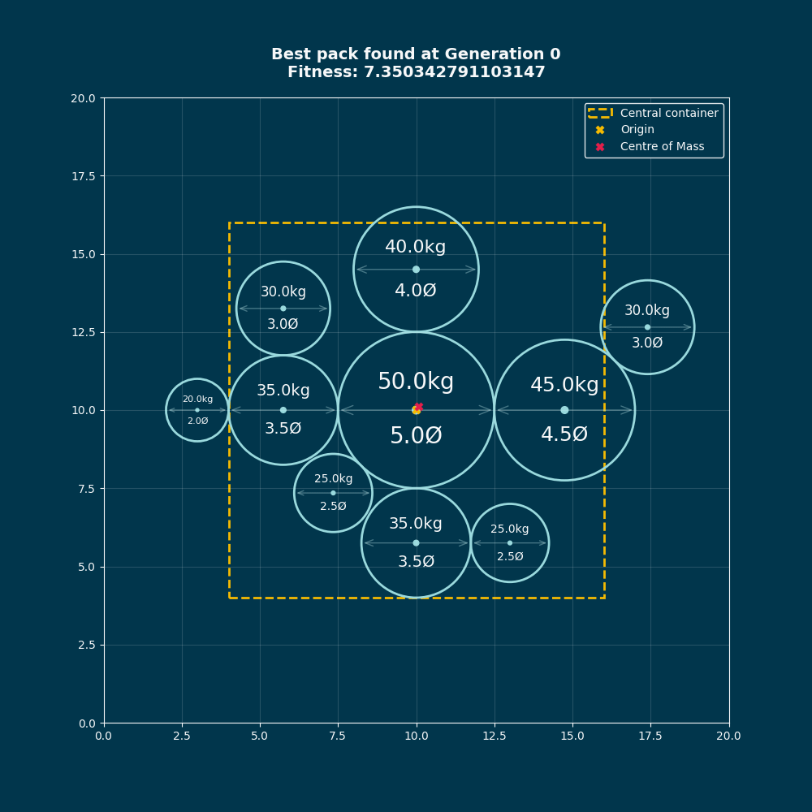

    
    

# Cargo Loading with Evolutionary Algorithms
This assessment concerns a cargo container loading problem: We are given a rectangular cargo
container and a set of cylindrical containers (barrels, drums, tanks) of different sizes and weights. Each
cylindrical container has a diameter and weight. The problem is to place the cylinders in the container
to minimize wasted space while ensuring weight distribution constraints are satisfied.

The container is treated as a two-dimensional rectangular footprint (width × depth) with a limit weight
w. Each cylindrical container is modelled as a circle of given diameter placed on the container floor at
a specific (x,y) coordinate. The goal is to place all circles subject to constraints.

### Key Constraints

- **Geometric constraint**: All cylinders must fit within the rectangular container boundaries
- **Weight distribution**: The centre of mass of all loaded items must fall within the central 60% of the
container (to prevent tipping during transport).
- **Weight limit**: Total weight cannot exceed the container's maximum capacity.
- **Loading order**: Cylinders are loaded from the rear and cannot be moved once placed

---
[Assessment Brief](_DOCUMENTS/Assessment_Brief.pdf) 
[Project Report](_DOCUMENTS/)

Grade: **???** / 100

---

### Setup
To experiment with the program and its results, please consider the following sections.

#### Basic
- Select main.py to run the genetic algorithm, with the features:
  - **Number of Sides per Cylinder**: _8_
  - **Population Size**: _50_
  - **Max Generations**: _100_
  - **Selection Method**: _Tournament-Style_
  - **Crossover Technique**: _Single-Point_
  - **Mutation Rate**: _0.1_
  
- Use config.py to change a few parameters for the program. Information regarding what each parameter does is also detailed within that file.

#### Advanced
- Within population.py, specifically under the "evolve" procedure, you can edit the selection method and crossover technique being used. This can be found under the comment # - Create new population - #

### Interactivity
The following table describes the different key-press events each figure contains.

| Key         | Description                                                                                                                                      |
|-------------|--------------------------------------------------------------------------------------------------------------------------------------------------|
| a           | Toggles the annotations of each cylinder                                                                                                         |
| l           | Toggles the legend for each plot                                                                                                                 |
| Right Arrow | Used when MANUAL_FLICK = True, it moves to the next generation of results, in a way that is determined from the SLIDING_ANIMATION configuration. |
| Left Arrow  | Used when MANUAL_FLICK = True, it moves to the last generation of results, in a way that is determined by the SLIDING_ANIMATION configuration.   |

### File Outlines
| File name                  | Description                                                                                                                                                                                                                                                                                                                                                                                     |
|----------------------------|-------------------------------------------------------------------------------------------------------------------------------------------------------------------------------------------------------------------------------------------------------------------------------------------------------------------------------------------------------------------------------------------------|
| config.py                  | Contains publicly editable parameters for this program to use, whether it's for recording results, changing how figures show the evolutions, and more.                                                                                                                                                                                                                                          |
| main.py                    | Is the "Master Control Program" of this implementation, it joins the core elements of the project together. This includes binning the inputted cylinders into there own containers (dependent on weight), creating figures for each of those "bins", and then runs the genetic algorithm based on the parameters that it had been passed through.                                               |
| TEST.py                    | Alongside the TestCylinder object that inherits from the Cylinder class within cylinders.py, it showcases all the different test instances this project is to be challenged with.                                                                                                                                                                                                               |
| population.py              | A program that oversees how cylinders are organised into appropriate bins, and how the Population object handles that procedure alongside others including generating position strings, via CylinderGroups, how selection and crossover methods are used, the collection of evolutionary data to get a succinct summary, in addition to handling any animation or interaction demands required. |
| cylinders.py               | The file that converts the properties of a cylinder into Cylinder objects, whilst additionally holding Group objects that groups several cylinder objects to a particular position string. It also provides functions for decoding the position string into one that is feasible, as well as determining the fitness of this group/position string.                                             |
| canvas.py                  | Contains objects that are used to visualise any bin of cylinders, whether it be static or with an animation.                                                                                                                                                                                                                                                                                    |
| event_manager.py           | A script that handles any key-press events during the visualisation of a figure. This includes toggling the visibility of each figures legend and annotations, as well as managing any manual flicks made from the arrow keys.                                                                                                                                                                  |
| custom_patches/circle.py   | A Custom Patch used to illustrate each cylinder onto a figure. It has been modified to include annotations of its own properties and methods to change their visibility.                                                                                                                                                                                                                        |
| crossovers/__init__.py     | Ensures any file within this "crossover" directory is treated as part of a package.                                                                                                                                                                                                                                                                                                             |
| crossovers/davis_order.py  | A file that contains a function for a OX1 crossover method between two position strings.                                                                                                                                                                                                                                                                                                        |
| crossovers/multi_point.py  | A file that contains a function for a multi-point crossover method between two position strings.                                                                                                                                                                                                                                                                                                |
| crossovers/single_point.py | A file that contains a function for a single-point crossover method between two position strings.                                                                                                                                                                                                                                                                                               |
| crossovers/uniform.py      | A file that contains a function for a uniform crossover method between two position strings.                                                                                                                                                                                                                                                                                                    |

### Key Features
- Instead of outright discarding cylinders, each cylinder are packed into their own "bins". This is determined by a first-fit bin packing method that determines whether any new cylinder can fit in a container, based on their weights. If a cylinder is heavier than the containers weight, then it is discarded.
  
- Setting RECORD_RESULTS=True, you can get a JSON file containing the key information that happened within an evolution, in the the _TEST_RESULTS directory.
  
- Setting SLIDING_ANIMATIONS=True, can make the transitions between key generations smooth, by changing the FRAMES_PER_PATCH value, you can change the smoothness of this transition, however, it's recommended to remain at 30.
  
- Setting MANUAL_FLICK=True, allows you to flick through the key generations in your own time. Additionally, if you set SLIDING_ANIMATIONS=True here as well, switch between generations will become smooth as well.
